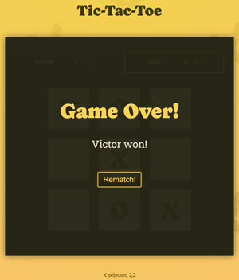

# Tic Tac Toe Game

This is a simple Tic Tac Toe game built using React. The game allows two players to take turns marking the spaces in a 3x3 grid. The first player to align three of their symbols horizontally, vertically, or diagonally wins the game.

  

## How to Play

To play the game, follow these steps:

1. Start by entering the names of the two players.
2. Players take turns clicking on empty squares to place their symbol (X or O).
3. The game ends when one player successfully aligns three of their symbols or when all squares are filled without a winner.

## Features

- Dynamic player names: Players can change their names during the game.
- Turn tracking: The game keeps track of each player's turn.
- Game log: The game displays a log of each player's move.
- Game Over detection: The game automatically detects when a player wins or when the game ends in a draw.

## Installation

To run this game locally, follow these steps:

1. Clone this repository.
2. Navigate to the project directory.
3. Run `npm install` to install dependencies.
4. Run `npm start` to start the development server.
5. Open your browser and navigate to `http://localhost:3000`.

## Dependencies

- React
- ReactDOM

